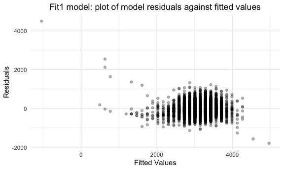
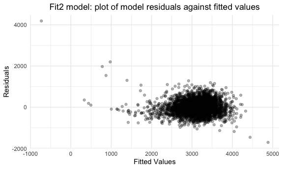
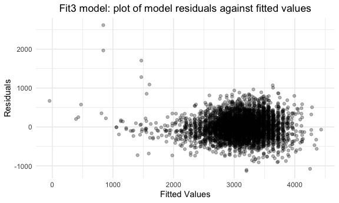
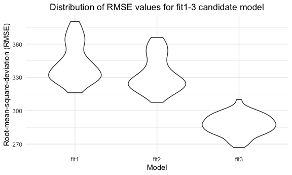

Homework 6
================
mm5951
2022-12-03

## Problem 1

Solutions provided by teaching team.

## Problem 2

### Data wrangling

First, I import the dataset using `read_csv()` and rename empty
observations to “na” (““,”Unknown”). Then, I wrangle data as per problem
instructions. This includes:

- Create a new “city_state” variable (e.g. “Baltimore, MD”) with
  `mutate()` and order by alphabetical orden using `str_c()`.
- Create a new “resolution” variable using the `disposition` syntaxis,
  indicating whehter a case is solved (those for which the disposition
  is “Closed by arrest”).
- Ensure that relevant variables are numeric using `as.numeric()` within
  a `mutate()` syntaxis.
- Omit cities Dallas, TX; Phoenix, AZ; and Kansas City, MO, as these
  don’t report victim race using `filter()`.
- Note one entry “Tulsa, AL” is excluded using `filter()`, as it is
  unclear whether it refers to Tulsa, Oklahoma or Birmingham, Alabama
  (data entry mistake).
- Limit the analysis those for whom “victim_race” is white or black
  using `filter(df, %in%)`.

``` r
homicide_df = read_csv("./data/homicide-data.csv", na = c("","Unknown")) %>% 
  mutate(city_state = str_c(city, state, sep = ", "),
         resolution = as.numeric(disposition == "Closed by arrest"),
         victim_age = as.numeric(victim_age),
         victim_sex = as.numeric(victim_sex == "Female")
  ) %>% 
  relocate(city_state) %>% 
  filter(city_state != "Dallas, TX",
         city_state != "Phoenix, AZ",
         city_state != "Kansas City, MO",
         city_state != "Tulsa, AL",
         victim_race %in%  c("Black", "White")
        )
```

### Logistic regression

**PROMPT**: For the city of Baltimore, MD, use the glm function to fit a
logistic regression with resolved vs unresolved as the outcome and
victim age, sex and race as predictors. Save the output of glm as an R
object; apply the broom::tidy to this object; and obtain the estimate
and confidence interval of the adjusted odds ratio for solving homicides
comparing male victims to female victims keeping all other variables
fixed.

Now run glm for each of the cities in your dataset, and extract the
adjusted odds ratio (and CI) for solving homicides comparing male
victims to female victims. Do this within a “tidy” pipeline, making use
of purrr::map, list columns, and unnest as necessary to create a
dataframe with estimated ORs and CIs for each city.

### Logsitic Regression Analysis: Baltimore, MD

Firstly, for the city of Baltimore, MD, I use the `glm()` function to
fit a logistic regression for the “resolution” as the outcome and
“victim age, sex and race” as predictors. The output of this analysis is
saved as an R object using `saveRDS()`.

``` r
baltimore_df = homicide_df %>%
  filter(city == "Baltimore") %>%
  glm(resolution ~ victim_age + victim_race + victim_sex, data = ., family = binomial()) %>%
  saveRDS(file = "data/baltimore_glm.rds")
```

Next, I apply the `broom::tidy()` function to the “baltimore_glm” object
to obtain the estimate as well as confidence interval (CI) of the
adjusted odds ratio (OR) for solving homicides according to the victim’s
sex while keeping all other variables fixed (reference category:
female).

``` r
readRDS(file = "data/baltimore_glm.rds") %>%
  broom::tidy(conf.int = TRUE) %>% 
  janitor::clean_names() %>%
  mutate(OR = exp(estimate),
         conf_low = exp(conf_low),
         conf_high = exp(conf_high)) %>%
  select(term, OR, conf_low, conf_high) %>% 
  filter(term == "victim_sex") %>%
  knitr::kable(digits = 3)
```

| term       |   OR | conf_low | conf_high |
|:-----------|-----:|---------:|----------:|
| victim_sex | 2.35 |    1.794 |     3.085 |

### Logsitic Regression Analysis: all United States cities

Finally, I run a similar logistic regression model for all US cities
(except for the abovementioned excluded due to data gaps). In doing so,
the ìteration using `purrr::map()` is applied to do the process within a
“tidy” pipeline. Finally, using `knitr::kable()`a table is generated
containing each city’s estimated ORs and CIs for solving homicides
comparing male victims to female victims (ref: female).

``` r
city_list = unique(homicide_df$city_state)
city_function = function(y){
  output = homicide_df %>%
    filter(city_state == y) %>%
    glm(resolution ~ victim_age + victim_race + victim_sex, data = ., family = binomial()) %>%
    broom::tidy(conf.int = TRUE) %>% 
    janitor::clean_names() %>%
    mutate(OR = exp(estimate),
         conf_low = exp(conf_low),
         conf_high = exp(conf_high)) %>%
    filter(term == "victim_sex") %>%
    select(term, OR, conf_low, conf_high)
}

final_list = map(city_list, city_function)
df_final = data.frame(city_list[1],final_list[[1]])
names(df_final)[1] = "city_state"
for (i in 2:47) {
  df = data.frame(city_list[i],final_list[[i]])
  names(df)[1] = "city_state"
  df_final = rbind(df_final, df)
}
knitr::kable(df_final, digits = 3)
```

| city_state         | term       |    OR | conf_low | conf_high |
|:-------------------|:-----------|------:|---------:|----------:|
| Albuquerque, NM    | victim_sex | 0.566 |    0.266 |     1.213 |
| Atlanta, GA        | victim_sex | 1.000 |    0.686 |     1.470 |
| Baltimore, MD      | victim_sex | 2.350 |    1.794 |     3.085 |
| Baton Rouge, LA    | victim_sex | 2.622 |    1.463 |     4.894 |
| Birmingham, AL     | victim_sex | 1.149 |    0.761 |     1.750 |
| Boston, MA         | victim_sex | 1.499 |    0.794 |     2.850 |
| Buffalo, NY        | victim_sex | 1.921 |    1.069 |     3.467 |
| Charlotte, NC      | victim_sex | 1.131 |    0.719 |     1.816 |
| Chicago, IL        | victim_sex | 2.438 |    1.997 |     2.975 |
| Cincinnati, OH     | victim_sex | 2.501 |    1.499 |     4.322 |
| Columbus, OH       | victim_sex | 1.878 |    1.337 |     2.652 |
| Denver, CO         | victim_sex | 2.087 |    1.039 |     4.297 |
| Detroit, MI        | victim_sex | 1.717 |    1.363 |     2.165 |
| Durham, NC         | victim_sex | 1.231 |    0.603 |     2.615 |
| Fort Worth, TX     | victim_sex | 1.495 |    0.892 |     2.541 |
| Fresno, CA         | victim_sex | 0.749 |    0.328 |     1.763 |
| Houston, TX        | victim_sex | 1.406 |    1.104 |     1.795 |
| Indianapolis, IN   | victim_sex | 1.088 |    0.806 |     1.474 |
| Jacksonville, FL   | victim_sex | 1.389 |    1.036 |     1.866 |
| Las Vegas, NV      | victim_sex | 1.194 |    0.869 |     1.650 |
| Long Beach, CA     | victim_sex | 2.438 |    0.976 |     7.006 |
| Los Angeles, CA    | victim_sex | 1.511 |    1.048 |     2.191 |
| Louisville, KY     | victim_sex | 2.039 |    1.276 |     3.317 |
| Memphis, TN        | victim_sex | 1.383 |    1.017 |     1.901 |
| Miami, FL          | victim_sex | 1.941 |    1.145 |     3.289 |
| Milwaukee, wI      | victim_sex | 1.375 |    0.949 |     2.020 |
| Minneapolis, MN    | victim_sex | 1.056 |    0.532 |     2.101 |
| Nashville, TN      | victim_sex | 0.967 |    0.643 |     1.469 |
| New Orleans, LA    | victim_sex | 1.710 |    1.231 |     2.370 |
| New York, NY       | victim_sex | 3.811 |    2.062 |     7.533 |
| Oakland, CA        | victim_sex | 1.776 |    1.153 |     2.749 |
| Oklahoma City, OK  | victim_sex | 1.027 |    0.658 |     1.606 |
| Omaha, NE          | victim_sex | 2.614 |    1.407 |     5.029 |
| Philadelphia, PA   | victim_sex | 2.015 |    1.539 |     2.659 |
| Pittsburgh, PA     | victim_sex | 2.322 |    1.438 |     3.808 |
| Richmond, VA       | victim_sex | 0.994 |    0.502 |     2.068 |
| San Antonio, TX    | victim_sex | 1.419 |    0.808 |     2.546 |
| Sacramento, CA     | victim_sex | 1.495 |    0.761 |     3.065 |
| Savannah, GA       | victim_sex | 1.153 |    0.562 |     2.389 |
| San Bernardino, CA | victim_sex | 1.999 |    0.684 |     6.041 |
| San Diego, CA      | victim_sex | 2.421 |    1.205 |     5.226 |
| San Francisco, CA  | victim_sex | 1.646 |    0.866 |     3.208 |
| St. Louis, MO      | victim_sex | 1.422 |    1.073 |     1.887 |
| Stockton, CA       | victim_sex | 0.740 |    0.334 |     1.598 |
| Tampa, FL          | victim_sex | 1.238 |    0.538 |     2.945 |
| Tulsa, OK          | victim_sex | 1.025 |    0.648 |     1.642 |
| Washington, DC     | victim_sex | 1.447 |    0.987 |     2.146 |

### Data visualization

Finally, I create a plot that shows the estimated ORs and CIs for each
city. The cities are organized according to estimated OR.

``` r
OR_resolution = df_final %>%
  mutate(city_state = fct_reorder(city_state, OR)) %>% 
  ggplot(aes(x = city_state, y = OR)) +
  geom_point() +
  geom_errorbar(aes(ymin = conf_low, ymax = conf_high)) +
  labs(
    title = "OR and CI for a case resolution by victim's sex",
    x = "City, State",
    y = "Odds Ratio") +
  theme(axis.text.x = element_text(angle = 90, vjust = 0.5, hjust = 1))

OR_resolution
```


In this graph’s interpretation, it is important to note that the
reference category is female.

Any OR below 1 indicates that a female victim’s case resolution (that
is, to be classified as “closed by arrest”) is less likely when compared
to a male’s counterpart, all other variables hold constant. *For
instance, looking into Denver, an OR = 2.087 (1.039, 4.297) indicates
that a female victim’s case has a 108.7% increase in the odds of being
resolved when compared to males. Moreover, the CI does not contain the
value 1, which indicates it is significant. Conversely, Albuquerque’s OR
= 0.566 (0.266, 1.213) indicates a decrease in the case’s odds to be
resolved, although the CI contains 1 and therefore this result is not
significant.*

Overall, we observe great variability in terms of resolution of a
homicide case by the victim’s sex. To be noted is the fact that some
cities such as New York experience great variance, as its CI is large
(OR: 3.811, (2.062 7.533)).

## Problem 3

### Data wrangling

First, I load using `read_csv()` and wrangle it so it is tidy for
regression analysis. Using `mutate()` certain variables are recoded so
that binary data collection is more easily understandable (e.g. for
`babysex` variable 1 refers to male and 2 to female), and using
`sum(is.na())` I check for missing data on the dataset.

``` r
birthweight = read_csv("./data/birthweight.csv") %>% 
  mutate(babysex = factor(if_else(babysex == 1, "male", "female")),
         frace = factor(recode(frace, '1' = "White", '2' = "Black", '3' = "Asian", 
                               '4' = "Puerto Rican", '8' = "Other", '9' = "Unknown")),
         mrace = factor(recode(mrace,'1' = "White", '2' = "Black", '3' = "Asian", 
                               '4' = "Puerto Rican", '8' = "Other", '9' = "Unknown")),
         malform = factor(recode(malform, '0' = "absent", '1' = "present")))

sum(is.na(birthweight))
```

    ## [1] 0

### Linear regression model for birth weight

Next, I generate a regression model for birth weight (`bwt`) against
another potential associated variable. Hypothesizing that a baby’s birth
weight is typically associated with its length (`blenght`), I use a
scatter plot as an exploratory analysis to investigate the basis of this
hypothesis (using `ggplot()`).

``` r
birthweight %>% 
  ggplot(aes(x = blength, y = bwt)) + 
  geom_point(alpha = .5) +
  labs(title = "Scatter plot of recorded baby's weight and length at birth",
        x = "Birth lenght (cm)", 
       y = "Birth weight (g)") +
  theme(plot.title = element_text(hjust = 0.5))
```


As per the visualization, it appears that there might be a linear
relationship between a baby’s length and weight at birth. Thus, in a
linear logsitic regression model “fit1” I will input `blength` as a
predictor of the birth weight `bwt` into the function `lm()`. To assess
its fitting, I will plot the model residuals against fitted values.

``` r
fit1 = lm(bwt ~ blength, data = birthweight)

fit1 %>% 
  broom::tidy() %>% 
  knitr::kable(digits = 3)
```

| term        |  estimate | std.error | statistic | p.value |
|:------------|----------:|----------:|----------:|--------:|
| (Intercept) | -3841.267 |    95.122 |   -40.382 |       0 |
| blength     |   139.811 |     1.909 |    73.233 |       0 |

``` r
birthweight %>% 
  modelr::add_residuals(fit1) %>% 
  modelr::add_predictions(fit1) %>% 
  ggplot(aes(x = pred, y = resid)) +
  geom_point(alpha = .3) +
  labs(title = "Fit1 model: plot of model residuals against fitted values",
       x = "Fitted Values",
       y = "Residuals") +
  theme(plot.title = element_text(hjust = 0.5))
```



The avbove plot shows that the linearity assumption likely holds.

### Two alternative linear regression models for birth weight

In order to assess the fitting of the fit1 model, I will compare it to
two alternative models, entailing:

- fit2: using length at birth and gestational age as predictors (main
  effects only);
- fit3: using head circumference, length, sex, and all interactions
  (including the three-way interaction) between these as predictors.

To do so, I use again the function `lm()` including the abovementioned
variables in its arguments. Again, the model of residuals is plotted for
both fit2 and fit3.

``` r
fit2 = lm(bwt ~ blength + gaweeks, data = birthweight)

fit2 %>% 
  broom::tidy() %>% 
  knitr::kable(digits = 3)
```

| term        |  estimate | std.error | statistic | p.value |
|:------------|----------:|----------:|----------:|--------:|
| (Intercept) | -4347.667 |    97.958 |   -44.383 |       0 |
| blength     |   128.556 |     1.990 |    64.604 |       0 |
| gaweeks     |    27.047 |     1.718 |    15.744 |       0 |

``` r
birthweight %>% 
  modelr::add_residuals(fit2) %>% 
  modelr::add_predictions(fit2) %>% 
  ggplot(aes(x = pred, y = resid)) +
  geom_point(alpha = .3) +
  labs(title = "Fit2 model: plot of model residuals against fitted values",
       x = "Fitted Values",
       y = "Residuals") +
  theme(plot.title = element_text(hjust = 0.5))
```



``` r
fit3 = lm(bwt ~ bhead + blength + babysex + bhead*blength + bhead*babysex + blength*babysex + bhead*blength*babysex, data = birthweight)

fit3 %>% 
  broom::tidy() %>% 
  knitr::kable(digits = 3)
```

| term                      |  estimate | std.error | statistic | p.value |
|:--------------------------|----------:|----------:|----------:|--------:|
| (Intercept)               |  -801.949 |  1102.308 |    -0.728 |   0.467 |
| bhead                     |   -16.598 |    34.092 |    -0.487 |   0.626 |
| blength                   |   -21.646 |    23.372 |    -0.926 |   0.354 |
| babysexmale               | -6374.868 |  1677.767 |    -3.800 |   0.000 |
| bhead:blength             |     3.324 |     0.713 |     4.666 |   0.000 |
| bhead:babysexmale         |   198.393 |    51.092 |     3.883 |   0.000 |
| blength:babysexmale       |   123.773 |    35.119 |     3.524 |   0.000 |
| bhead:blength:babysexmale |    -3.878 |     1.057 |    -3.670 |   0.000 |

``` r
birthweight %>% 
  modelr::add_residuals(fit3) %>% 
  modelr::add_predictions(fit3) %>% 
  ggplot(aes(x = pred, y = resid)) +
  geom_point(alpha = .3) +
  labs(title = "Fit3 model: plot of model residuals against fitted values",
       x = "Fitted Values",
       y = "Residuals") +
  theme(plot.title = element_text(hjust = 0.5))
```



### Comparison of the fit1-3 linear regression models for birth weight

Next, I cross-validate models fit1-3 in order to compare the predictive
performance of these competing methods. To do so, I will calculate and
compare the root mean squared error (RMSE) using the `modelr::crossv_mc`
function.

``` r
cv_df = 
  crossv_mc(birthweight, 100) %>% 
  mutate(
    train = map(train, as_tibble),
    test = map(test, as_tibble)
  ) %>% 
  mutate(
    fit1_mod = map(train, ~lm(bwt ~ blength, data = birthweight)),
    fit2_mod = map(train, ~lm(bwt ~ blength + gaweeks,birthweight)),
    fit3_mod = map(train, ~lm(bwt ~ bhead + blength + babysex + bhead*blength + bhead*babysex +       blength*babysex + bhead*blength*babysex, birthweight))
  ) %>% 
  mutate(
    rmse_fit1 = map2_dbl(fit1_mod, test, ~rmse(model = .x, data = .y)),
    rmse_fit2 = map2_dbl(fit2_mod, test, ~rmse(model = .x, data = .y)),
    rmse_fit3 = map2_dbl(fit3_mod, test, ~rmse(model = .x, data = .y))
  )
```

Next, I will compare plot and compare the distribution of RMSE values
for each candidate model (fit1-3).

``` r
cv_df %>% 
  select(starts_with("rmse")) %>% 
  pivot_longer(
    everything(),
    names_to = "model", 
    values_to = "rmse",
    names_prefix = "rmse_") %>% 
  mutate(model = fct_inorder(model)) %>% 
  ggplot(aes(x = model, y = rmse)) + geom_violin() +
  labs(
    title = "Distribution of RMSE values for fit1-3 candidate model",
    x = "Model",
    y = "Root-mean-square-deviation (RMSE)"
  ) +
  theme(plot.title = element_text(hjust = 0.5))
```



As per the violin graph visualization above, it becomes apparent that
fit3 model has the lowest RMSE value (around 275) when compared to the
other two models (RMSE around 325). Moreover, fit3 RMSE has a more
centered distribution. Overall, it indicates that fit3 would be the best
fitting model of the three candidates investigated.

*That’s it for homework 6!*
