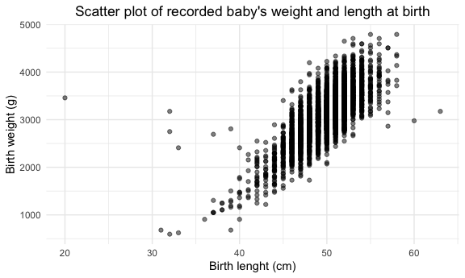

Homework 6
================
mm5951
2022-11-29

## Problem 1

Solutions provided by teaching team.

## Problem 2

### Data wrangling

**PROMPT**: Create a city_state variable (e.g. “Baltimore, MD”), and a
binary variable indicating whether the homicide is solved. Omit cities
Dallas, TX; Phoenix, AZ; and Kansas City, MO – these don’t report victim
race. Also omit Tulsa, AL – this is a data entry mistake. For this
problem, limit your analysis those for whom victim_race is white or
black. Be sure that victim_age is numeric.

First, I import the dataset using `read_csv()` and rename empty
observations to “na” (““,”Unknown”). Then, I wrangle data as per problem
instructions. This includes:

- Create a new “city_state” variable (e.g. “Baltimore, MD”) with
  `mutate()` and order by alphabetical orden using `str_c()`.
- Create a new “resolution” variable using the `case_when()` syntaxis,
  indicating whehter a case is resolved or not (those for which the
  disposition is “Closed without arrest” or “Open/No arrest”).
- Note one entry “Tulsa, AL” is excluded using `filter()`, as it is
  unclear whether it refers to Tulsa, Oklahoma or Birmingham, Alabama.
- **OTHER REQUESTS OF EXCLUSION & as.numeric**

``` r
homicide_df = read_csv("./data/homicide-data.csv", na = c("","Unknown")) %>% 
  mutate(city_state = str_c(city, state, sep = ", "),
         resolution = case_when(
           disposition == "Closed without arrest" ~ "unsolved",
           disposition == "Open/No arrest" ~ "unsolved",
           disposition == "Closed by arrest" ~ "solved"
         )) %>% 
  relocate(city_state) %>% 
  filter(city_state != "Tulsa, AL")
```

**CONCLUSION**: The “homicide_df_raw” dataset contains 14 variables and
52178 observations.

### Logistic regression

**PROMPT**: For the city of Baltimore, MD, use the glm function to fit a
logistic regression with resolved vs unresolved as the outcome and
victim age, sex and race as predictors. Save the output of glm as an R
object; apply the broom::tidy to this object; and obtain the estimate
and confidence interval of the adjusted odds ratio for solving homicides
comparing male victims to female victims keeping all other variables
fixed.

Now run glm for each of the cities in your dataset, and extract the
adjusted odds ratio (and CI) for solving homicides comparing male
victims to female victims. Do this within a “tidy” pipeline, making use
of purrr::map, list columns, and unnest as necessary to create a
dataframe with estimated ORs and CIs for each city.

### Data visualization

**PROMPT**: Create a plot that shows the estimated ORs and CIs for each
city. Organize cities according to estimated OR, and comment on the
plot.

## Problem 3

### Data wrangling

First, I load using `read_csv()` and wrangle it so it’s tidy for
regression analysis. Using `mutate()` certain variables are recoded so
that binary data collection is more easily understandable (e.g. for
`babysex` variable 1 refers to male and 2 to female), and using
`sum(is.na())` I check for missing data on the dataset.

``` r
birthweight = read_csv("./data/birthweight.csv") %>% 
  mutate(babysex = factor(if_else(babysex == 1, "male", "female")),
         frace = factor(recode(frace, '1' = "White", '2' = "Black", '3' = "Asian", 
                               '4' = "Puerto Rican", '8' = "Other", '9' = "Unknown")),
         mrace = factor(recode(mrace,'1' = "White", '2' = "Black", '3' = "Asian", 
                               '4' = "Puerto Rican", '8' = "Other", '9' = "Unknown")),
         malform = factor(recode(malform, '0' = "absent", '1' = "present")))

sum(is.na(birthweight))
```

    ## [1] 0

### Linear regression model for birth weight

Next, I generate a regression model for birth weight (`bwt`) against
another potential associated variable. Since I suspect a baby’s birth
weight is typically associated with its length (`blenght`), I use a
scatter plot as an exploratory analysis (using `ggplot()`).

``` r
birthweight %>% 
  ggplot(aes(x = blength, y = bwt)) + 
  geom_point(alpha = .5) +
  labs(title = "Scatter plot of recorded baby's weight and length at birth",
        x = "Birth lenght (cm)", 
       y = "Birth weight (g)") +
  theme(plot.title = element_text(hjust = 0.5))
```



As per the visualization, it appears that there might be a linear
relationship between a baby’s length and weight at birth. Thus, in a
linear logsitic regression model “fit1” I will input `blength` as a
predictor of the birth weight `bwt` into the function `lm()`. To assess
its fitting, I will plot the model residuals against fitted values.

``` r
fit1 = lm(bwt ~ blength, data = birthweight)

fit1 %>% 
  broom::tidy() %>% 
  knitr::kable()
```

| term        |   estimate | std.error | statistic | p.value |
|:------------|-----------:|----------:|----------:|--------:|
| (Intercept) | -3841.2667 | 95.122166 | -40.38246 |       0 |
| blength     |   139.8109 |  1.909124 |  73.23301 |       0 |

``` r
birthweight %>% 
  modelr::add_residuals(fit1) %>% 
  modelr::add_predictions(fit1) %>% 
  ggplot(aes(x = pred, y = resid)) +
  geom_point(alpha = .3) +
  labs(title = "Fit1 model: plot of model residuals against fitted values",
       x = "Fitted Values",
       y = "Residuals") +
  theme(plot.title = element_text(hjust = 0.5))
```


### Two alternative linear regression models for birth weight

In order to assess the fitting of the fit1 model, I will compare it to
two alternative models, entailing:

- fit2: using length at birth and gestational age as predictors (main
  effects only);
- fit3: using head circumference, length, sex, and all interactions
  (including the three-way interaction) between these as predictors.

To do so, I use again the function `lm()` including the abovementioned
variables in its arguments. Again, the model of residuals is plotted for
both fit2 and fit3.

``` r
fit2 = lm(bwt ~ blength + gaweeks,birthweight)

fit2 %>% 
  broom::tidy() %>% 
  knitr::kable()
```

| term        |    estimate | std.error | statistic | p.value |
|:------------|------------:|----------:|----------:|--------:|
| (Intercept) | -4347.66707 | 97.958360 | -44.38281 |       0 |
| blength     |   128.55569 |  1.989891 |  64.60439 |       0 |
| gaweeks     |    27.04673 |  1.717930 |  15.74379 |       0 |

``` r
birthweight %>% 
  modelr::add_residuals(fit2) %>% 
  modelr::add_predictions(fit2) %>% 
  ggplot(aes(x = pred, y = resid)) +
  geom_point(alpha = .3) +
  labs(title = "Fit2 model: plot of model residuals against fitted values",
       x = "Fitted Values",
       y = "Residuals") +
  theme(plot.title = element_text(hjust = 0.5))
```


``` r
fit3 = lm(bwt ~ bhead + blength + babysex + bhead*blength + bhead*babysex + blength*babysex + bhead*blength*babysex, birthweight)

fit3 %>% 
  broom::tidy() %>% 
  knitr::kable()
```

| term                      |     estimate |    std.error |  statistic |   p.value |
|:--------------------------|-------------:|-------------:|-----------:|----------:|
| (Intercept)               |  -801.948671 | 1102.3077046 | -0.7275180 | 0.4669480 |
| bhead                     |   -16.597546 |   34.0916082 | -0.4868514 | 0.6263883 |
| blength                   |   -21.645964 |   23.3720477 | -0.9261475 | 0.3544209 |
| babysexmale               | -6374.868351 | 1677.7669213 | -3.7996150 | 0.0001469 |
| bhead:blength             |     3.324444 |    0.7125586 |  4.6655020 | 0.0000032 |
| bhead:babysexmale         |   198.393181 |   51.0916850 |  3.8830816 | 0.0001047 |
| blength:babysexmale       |   123.772887 |   35.1185360 |  3.5244319 | 0.0004288 |
| bhead:blength:babysexmale |    -3.878053 |    1.0566296 | -3.6702106 | 0.0002453 |

``` r
birthweight %>% 
  modelr::add_residuals(fit3) %>% 
  modelr::add_predictions(fit3) %>% 
  ggplot(aes(x = pred, y = resid)) +
  geom_point(alpha = .3) +
  labs(title = "Fit3 model: plot of model residuals against fitted values",
       x = "Fitted Values",
       y = "Residuals") +
  theme(plot.title = element_text(hjust = 0.5))
```


### Comparison of the fit1-3 linear regression models for birth weight

Next, I cross-validate models fit1-3 in order to compare the predictive
performance of these competing methods. To do so, I will calculate and
compare the root mean squared error (RMSE) calculated using the
`modelr::crossv_mc` function.

``` r
cv_df = 
  crossv_mc(birthweight, 100) %>% 
  mutate(
    train = map(train, as_tibble),
    test = map(test, as_tibble)
  ) %>% 
  mutate(
    fit1_mod = map(train, ~lm(bwt ~ blength, data = birthweight)),
    fit2_mod = map(train, ~lm(bwt ~ blength + gaweeks,birthweight)),
    fit3_mod = map(train, ~lm(bwt ~ bhead + blength + babysex + bhead*blength + bhead*babysex +       blength*babysex + bhead*blength*babysex, birthweight))
  ) %>% 
  mutate(
    rmse_fit1 = map2_dbl(fit1_mod, test, ~rmse(model = .x, data = .y)),
    rmse_fit2 = map2_dbl(fit2_mod, test, ~rmse(model = .x, data = .y)),
    rmse_fit3 = map2_dbl(fit3_mod, test, ~rmse(model = .x, data = .y))
  )
```

Next, I will compare plot and compare the distribution of RMSE values
for each candidate model (fit1-3).

``` r
cv_df %>% 
  select(starts_with("rmse")) %>% 
  pivot_longer(
    everything(),
    names_to = "model", 
    values_to = "rmse",
    names_prefix = "rmse_") %>% 
  mutate(model = fct_inorder(model)) %>% 
  ggplot(aes(x = model, y = rmse)) + geom_violin() +
  labs(
    title = "distribution of RMSE values for three candidate model",
    x = "Model",
    y = "Root-mean-square-deviation (RMSE)"
  ) +
  theme(plot.title = element_text(hjust = 0.5))
```


As per the visualization above, it becomes apparent that fit3 model has
the lowest RMSE value (around 275) when compared to the other two models
(RMSE around 325). Moreover, fit3 RMSE has a more centered distribution.
Overall, it indicates that fit3 would be the best fitting model of the
three candidates investigated.

*That’s it for homework 6!*
